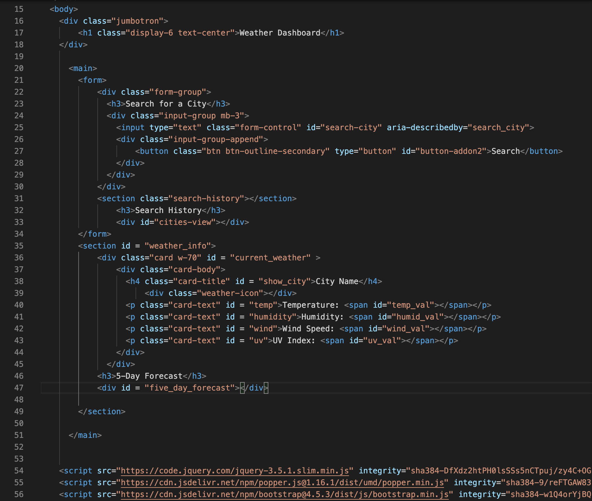
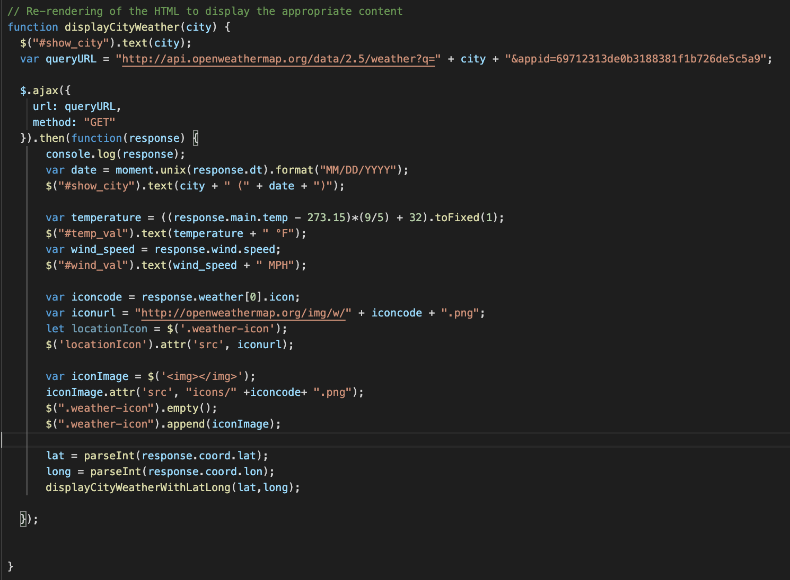
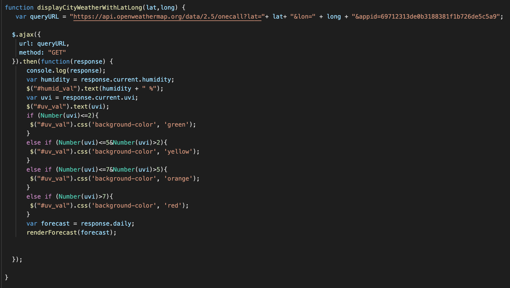
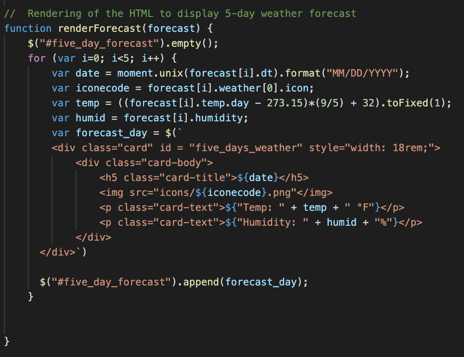
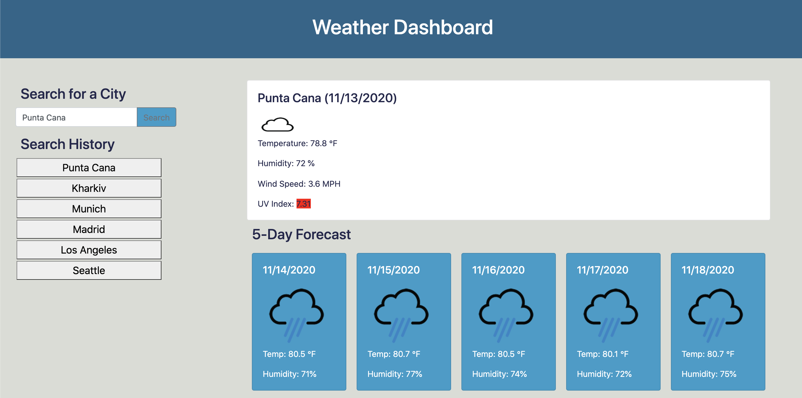
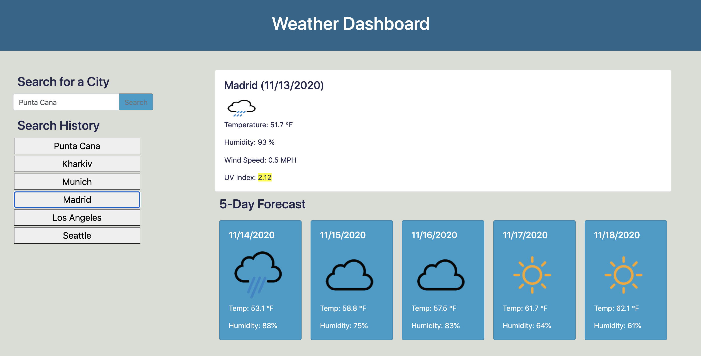
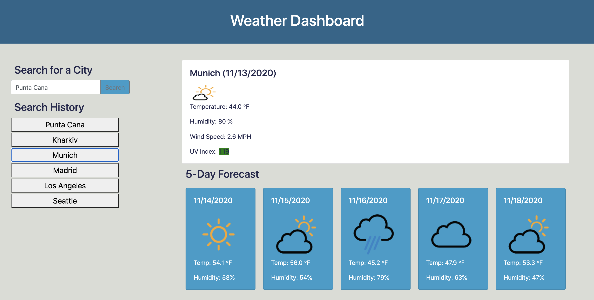

# Weather dashboard
This repository contains the solution for the homework assignment for unit 6 of UW Coding Bootcamp. This is an interactive application that shows the current weather and 5-day forecast for the selected cities.

# Task
The goal of the task was to develop an interactive weather dashboard.
The expected functionoality is described below: 

* For the searched city, the dashboard displays current and future conditions, and this city is added to the search history
* Current weather conditions include city name, the date, an icon representation of weather conditions, the temperature, the humidity, the wind speed, and the UV index.
* Background color of the uv-index reflect for different categories of air quality based on it's value: green (<=2), yellow (<=5), orange (<=7), and red (>7),
* Future weather conditions include a 5-day forecast that displays the date, an icon representation of weather conditions, the temperature, and the humidity
* The user can click on the city in the search history and be presented with the same information 
* All the searhed history is saved in the local storage and is accessible after page is reloaded. 
* When the page reloads, the last searched city forecast is displayed.

# URL to a live page
Link to a live page: https://kgo87.github.io/weather_dashboard/

# Project Summary
The folder contains  *.html* and  *.css*, *.js* files, folder with weather icons from openweather and supplemental screenshots.

## HTML code
Various bootstrap elements (form, jumbotron, card) were used in combination with default HTML elements (
, <section>, etc). Layout for the current weather conditions was developed in Html and rendered with JS. For the future conditions, bothe layout and rendering was performed in JS. The structure of the HTML is shown in the screenshot:

## JS code
Several AJAX calls were developed to access different elements of weather information. 
* Current temperature, humidity, date and weather icon was available through Current Weather API based on the city name.

* Future Conditions as well as current humidity and UV index, were accessed through One Call Weather API based on the cities latitude and longitude. 

Several additional functions were added to accomplish rendering and response to click events.

# Finished product
Here are several screenshots showing the functionality of the developed weather dashboard.
Weather for Punta Cana (unhealthy UV):

Weather for Madrid (moderate UV):

Weather for Munich (light UV):

# Contact details
If you have any questions, contact me via email: 

